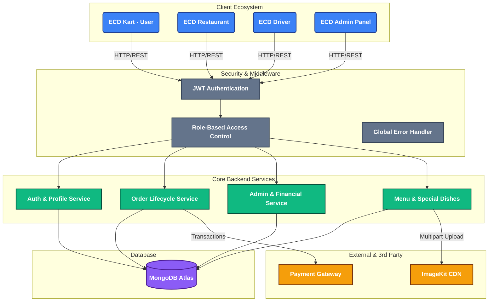

# ECD Platform - Comprehensive System Architecture

This document provides a complete systemic overview and architecture design of the **ECD Ecosystem**, which connects Users, Restaurants, Riders, and Admins in a unified, real-time marketplace.

---

## 1. Ecosystem Overview

The ecosystem is composed of five primary pillars:

1. **ECD Kart (User App)**: Cross-platform frontend for customers to browse restaurants, add special dishes, place orders, and track riders in real-time.
2. **ECD Restaurant (Vendor App)**: Dedicated portal for restaurant owners to manage their menus, toggle item availability, accept incoming orders, and track their B2B payouts.
3. **ECD Driver (Rider App)**: Mobile application for delivery executives to receive real-time order assignments, update geolocation, and securely verify deliveries using OTPs.
4. **ECD Admin (Admin Panel)**: Centralized command center for platform operators to monitor total revenue, manage user roles, onboard/delete restaurants, and process rider/restaurant payouts.
5. **ECD Core API (Backend)**: A robust Node.js/Express server that acts as the single source of truth, enforcing business logic, authentication, and database integrity.

---

## 2. System Architecture & Data Flow

The following visual diagram illustrates how the components securely communicate through middlewares and services.

---

## 3. Middleware & Security Layer

The backend utilizes strict middleware chains before any route controller is executed:

1. **`asyncHandler`**: Wraps every route to catch unhandled promise rejections, preventing server crashes and routing them to the global error middleware.
2. **`jwtAuth`**: Extracts the Bearer token from headers, verifies it against the `JWT_SECRET`, and attaches the decoded user context (`req.user = { _id, role }`) to the request.
3. **`requireRole(role)`**: A specialized verification gate. For example, `requireRole("admin")` ensures that even if a valid JWT is provided, a standard "customer" cannot access financial dashboard routes.
4. **`multer`**: Intercepts `multipart/form-data` streams for image uploads (e.g., Special Dishes, User Avatars), buffers them in memory, and passes them to the controller for ImageKit upload.

---

## 4. Connectivity & Operational Flow

### Order Lifecycle (User -> Restaurant -> Rider)
1. **Placement**: User places an order via the User App. The Backend calculates prices, verifies stock, and creates an `Order` document with status `pending`.
2. **Acceptance**: The Restaurant App polls or receives notifications for new orders. The vendor accepts, shifting the status to `preparing`.
3. **Driver Assignment**: The Backend's assignment algorithm locates the nearest active rider and triggers the `Driver App`. 
4. **Delivery**: The rider picks up the order. Upon reaching the customer, the rider inputs a secure `Delivery OTP` generated on the User App to mark the order as `delivered`.

### Financial Flow (Revenue vs Payouts)
- **Gross Merchandise Value (GMV)**: Captured when an order is completed.
- **Restaurant Wallet**: 
  - Earns `(Order Value - Platform Commission)`.
  - The Admin uses the **Admin Panel -> Restaurant Payouts** UI to record manual UPI settlements and deduct this balance.
- **Rider Wallet**:
  - Earns `Delivery Fee`.
  - Riders request withdrawals via their app; Admins approve them via the **Admin Panel -> Rider Payouts** UI.

---

## 5. Deployment & Tech Stack

- **Frontend Frameworks**: React.js with TypeScript and Vite.
- **Styling**: Vanilla CSS with modern Glassmorphism aesthetics, utilizing CSS variables for theme management.
- **Backend**: Node.js, Express.js, TypeScript.
- **Database**: MongoDB (Mongoose ODM).
- **Icons**: Lucide React.
